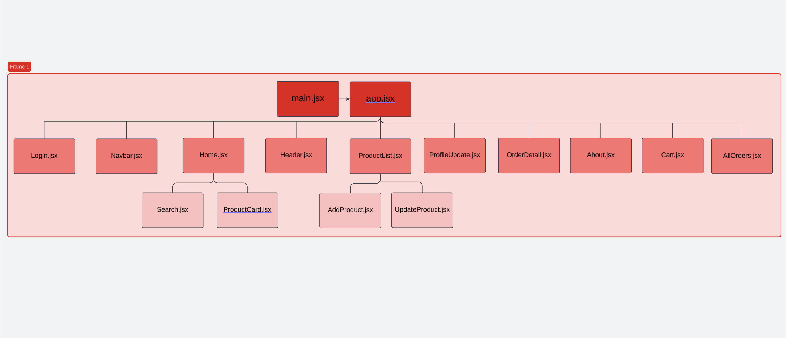

## GA-mart

# Supermarket React Website

This is a simple **Supermarket React Website** built with **React**. The website allows users to browse a variety of supermarket products, add them to the shopping cart, and view the total price of their purchase.

---

# Entity Relationship (ER) Diagram ERD :

## Relation

- **One to one relation**: each user have one cart.
- **One to many relation**:each user can have many orders.
- **One to many**: each cart have one or many product.

---

# wireframe

## our wireframe:

---

# Component hierarchy:

## components that we need:

---

## Features

- **Product Listing**: Displays a list of supermarket products.
- **Add/Remove Items**: Users can add items to their cart and remove them as needed.
- **Total Price Calculation**: Automatically calculates the total price based on the selected items.
- **Responsive Design**: The website is designed to be responsive for mobile and desktop views.
- **React Router**: Used for navigating between pages like Home, Product Details, Cart, etc.

---

## Technologies Used

- **React**: JavaScript library for building user interfaces.
- **React Router**: For page navigation.
- **CSS**: For styling the app (or you can use CSS frameworks like Bootstrap or Material UI).
- **useState** and **useEffect**: For state management and side effects.

---
